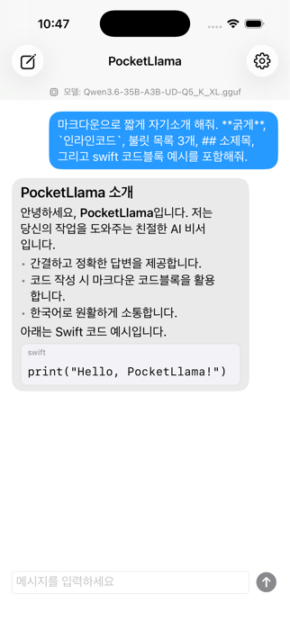
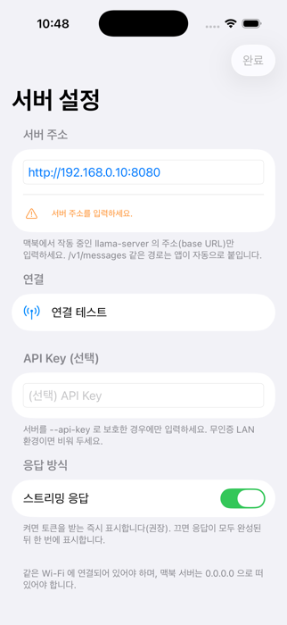

# PocketLlama

맥북에서 `llama.cpp`(`llama-server`)로 서빙하는 **Qwen3.6-35B-A3B** 모델에, 아이폰 SwiftUI 앱이 **Anthropic 호환 `/v1/messages`(SSE 스트리밍)**로 붙어 멀티턴 채팅하는 로컬 LLM 클라이언트 MVP. 어시스턴트 답변은 **마크다운으로 렌더링**된다(굵게·코드블록·리스트 등).

<p align="center">
  
  &nbsp;&nbsp;
  
</p>

## 구조
```
.
├── app/PocketLlama.xcodeproj   # iOS 앱 (SwiftUI, URLSession)
│   └── PocketLlama/            #   Models·Utilities·Services·Stores·ViewModels·Views
├── server/                     # llama.cpp 서빙 스크립트 (serve.sh: HOST 변형, test-anthropic.sh)
├── models/                     # 모델 가중치(gitignore, 하드링크) — Qwen3.6-35B-A3B-UD-Q5_K_XL.gguf
├── plans/                      # 구현 계획서(v3) + 리뷰
└── .claude/                    # 하네스(에이전트·스킬) — 아래
```

## 빠른 시작

### 1) 서버 기동 (맥북)
```bash
./server/serve.sh                       # 시뮬레이터용 (127.0.0.1 기본)
HOST=0.0.0.0 ./server/serve.sh          # 실기기/LAN 접속용
# 게이트 검증(권장): .claude/skills/server-gate/scripts/gate.sh --out plans/_gate.md
```
> ⚠️ `0.0.0.0` + 무인증은 같은 Wi-Fi 전체 노출. 신뢰된 가정용 LAN에서만. (보안: `server/README.md`)

### 2) 앱 빌드/실행 (Xcode)
```bash
open app/PocketLlama.xcodeproj
```
- 상단에서 기기 선택 후 **⌘R** → `SettingsView`에 서버 주소 입력 → 연결 테스트 → 채팅.
- **서버 주소**: 시뮬레이터는 맥과 네트워크를 공유하므로 `http://127.0.0.1:8080`. 실기기는 맥의 LAN IP(`http://192.168.x.x:8080`) + 서버를 `HOST=0.0.0.0`으로 기동.
- **외부(셀룰러/다른 Wi-Fi)에서 접속**: 포트포워딩 대신 [Tailscale](https://tailscale.com)(메시 VPN) 권장 — 맥·아이폰을 같은 계정으로 연결하고 앱 주소에 맥의 Tailscale IP(`http://100.x.x.x:8080`). 평문 http 는 `Info.plist`의 `NSAllowsArbitraryLoads`로 허용된다(Tailscale CGNAT 대역은 ATS 의 "로컬"에 미포함이라 `NSAllowsLocalNetworking`만으론 차단됨).
- 최소 타깃 iOS 26.4. 컴파일 검증은 `.claude/skills/xcode-build-check/scripts/build-check.sh`.

## 하네스 (.claude)
이 repo는 두 하네스로 운영한다(상세: `CLAUDE.md`):
- **`strict-review`** — 코드·계획서를 내부+agy(Gemini)·grok 외부 리뷰로 엄중 검토·통합
- **`ios-build`** — 계획서 Phase를 SwiftUI 코드로 구현(swift-builder)+검증(ios-qa), `server-gate`/`xcode-build-check` 보조
