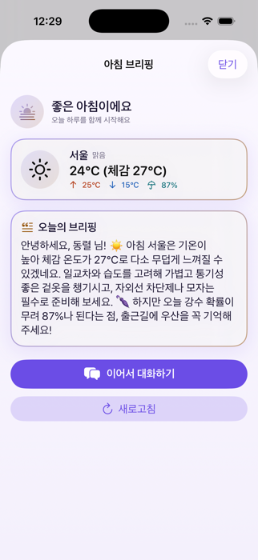

# PocketLlama

맥북에서 `llama.cpp`(`llama-server`)로 서빙하는 **Qwen3.6-35B-A3B** 모델에, 아이폰 SwiftUI 앱이 **Anthropic 호환 `/v1/messages`(SSE 스트리밍)**로 붙는 **개인화 로컬 LLM 비서**. 채팅을 넘어 ① 매일 아침 알림→**실시간 날씨 브리핑**, ② 모델 판단형 **웹검색 tool-calling**(출처 표기), ③ 프로필 개인화까지 — 데이터는 내 기기(아이폰·맥) 밖으로 나가지 않는다.

<p align="center">
  
  &nbsp;
  
  &nbsp;
  
</p>

## 기능

- **채팅** — SSE 스트리밍, 마크다운 렌더링, 취소, 멀티턴(최근 세션 복원)
- **아침 브리핑** — 매일 지정 시각 로컬 알림(벨) → 열면 **그 순간의** 날씨(Open-Meteo)+프로필로 브리핑 생성(전날 생성 없음, 당일 캐시+새로고침). 도시 프리셋 9곳
- **웹검색 tool-calling** — 모델이 실시간성 질문을 판단해 `web_search`(Tavily) 호출 → 출처 링크 포함 답변. 최대 2라운드 하드캡, 키 없으면 자동 비활성(네이티브 Anthropic tools — 게이트 실측 PASS)
- **개인화** — 설정의 이름·한 줄 소개를 system 프롬프트에 주입
- **보안** — API 키는 iOS **Keychain** 보관, `.env`/생성 시크릿은 git 차단
- **디자인 시스템** — 커스텀 토큰(라이트/다크), 대비 AA 전 조합 통과, Dynamic Type·44pt 터치 타깃

## 구조
```
.
├── app/PocketLlama.xcodeproj   # iOS 앱 (SwiftUI, URLSession)
│   └── PocketLlama/            #   Models·Utilities·Services·Stores·ViewModels·Views·DesignSystem
├── server/                     # llama.cpp 서빙 스크립트 (serve.sh: HOST 변형, test-anthropic.sh)
├── models/                     # 모델 가중치(gitignore, 하드링크) — Qwen3.6-35B-A3B-UD-Q5_K_XL.gguf
├── scripts/                    # gen-secrets.sh (.env → Generated/Secrets.swift, gitignored)
├── plans/                      # 컨셉·구현 계획·리서치·리뷰
└── .claude/                    # 하네스(에이전트·스킬) — 아래
```

## 빠른 시작

### 1) 서버 기동 (맥북)
```bash
./server/serve.sh                       # 시뮬레이터용 (127.0.0.1 기본)
HOST=0.0.0.0 ./server/serve.sh          # 실기기/LAN 접속용
# 게이트 검증(권장): .claude/skills/server-gate/scripts/gate.sh --out plans/_gate.md
```
> ⚠️ `0.0.0.0` + 무인증은 같은 Wi-Fi 전체 노출. 신뢰된 가정용 LAN에서만. (보안: `server/README.md`)

### 2) (선택) 웹검색 키 주입
```bash
echo 'TAVILY_API_KEY=tvly-...' > .env   # 레포 루트(.env 는 git 차단됨)
./scripts/gen-secrets.sh                # → Generated/Secrets.swift 시드 생성(gitignored)
```
앱 첫 실행 시 Keychain 에 1회 시드되며, 이후엔 설정 화면에서 직접 관리한다. 키가 없으면 웹검색만 조용히 비활성.

### 3) 앱 빌드/실행 (Xcode)
```bash
open app/PocketLlama.xcodeproj
```
- 상단에서 기기 선택 후 **⌘R** → 설정에 서버 주소 입력 → 연결 테스트 → 채팅. 브리핑은 설정의 "아침 브리핑" 토글(알림 권한 허용).
- **서버 주소**: 시뮬레이터는 `http://127.0.0.1:8080`. 실기기는 맥의 LAN IP(`http://192.168.x.x:8080`) + 서버 `HOST=0.0.0.0` 기동.
- **외부(셀룰러/다른 Wi-Fi)에서 접속**: 포트포워딩 대신 [Tailscale](https://tailscale.com)(메시 VPN) 권장 — 앱 주소에 맥의 Tailscale IP(`http://100.x.x.x:8080`). 평문 http 는 `Info.plist`의 `NSAllowsArbitraryLoads`로 허용된다(Tailscale CGNAT 대역은 ATS "로컬"에 미포함이라 `NSAllowsLocalNetworking`만으론 차단됨).
- 최소 타깃 iOS 26.4. 컴파일 검증은 `.claude/skills/xcode-build-check/scripts/build-check.sh`.
- 알림 **정시 발화·잠금화면**은 시뮬레이터에서 검증 불가 → 실기기 체크리스트(`_workspace/qa-final-e2e.md`, 무료 Apple ID 는 7일 재서명 필요).

## 문서 (plans/)

- `personalized-agent-concept.md` — 컨셉 SSOT("아침에 먼저 말 거는, 나를 기억하는 사적 비서") + 의사결정 로그
- `v0.1-weather-briefing-websearch-plan.md` — v0.1 구현 계획(게이트 실측·리뷰 반영)
- `research-personalized-agent-*.md` — 개인화 에이전트 리서치 5종(로드맵 Phase 0~5)

## 하네스 (.claude)
이 repo는 세 하네스로 운영한다(상세: `CLAUDE.md`):
- **`strict-review`** — 코드·계획서를 내부+agy(Gemini)·grok 외부 리뷰로 엄중 검토·통합
- **`ios-build`** — 계획서 Phase를 SwiftUI 코드로 구현(swift-builder)+검증(ios-qa), `server-gate`/`xcode-build-check` 보조
- **`ios-design`** — 디자인 시스템·화면 스타일(ui-designer)+HIG·접근성 검증(design-critic), `apple-hig`/`ios-design-system` 보조
