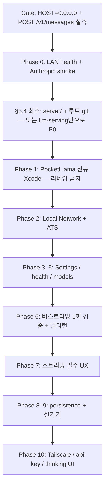

# SwiftUI PocketLlama iOS MVP 계획서 엄격 리뷰 (Grok)

**리뷰일:** 2026-06-05  
**대상 문서:** `plans/swiftui-ollama-ios-mvp-plan.md`  
**검증 대상:** 동 문서 + 실제 `~/workspace/dev/llm-serving` · 워크스페이스 `ollama-iphone-lab` 상태

> 참고: 같은 폴더의 `swiftui-ollama-ios-mvp-plan-review.md`는 일부 주장이 본문·`llm-serving`과 맞지 않습니다. 본 문서 §「부가 리뷰 문서와의 대조」에서 구분합니다.

---

## 1. 총평

| 항목 | 판정 |
|------|------|
| 방향성 (llama.cpp + LAN + SwiftUI MVP) | **적절** |
| v1→v2 전환·`HOST` 제약·API 필수 필드 | **잘 잡힘** |
| 실행 가능한 단일 로드맵 | **거의 가능**, 전제 검증·순서·채팅 계약에 **구멍** |
| 문서·레포·스크립트 정합성 | **아직 불일치** (계획만 v2, 코드/폴더는 v1) |

**결론:** 구현 착수 전에 **Phase 0 게이트(Anthropic API 실측)** 와 **§5.4 vs Phase 0 순서 정리** 없이 들어가면, iOS 쪽을 많이 짠 뒤 “서버/경로/스크립트 없음” 또는 “404/파싱 실패”로 막힐 가능성이 큽니다.

---

## 2. 잘 된 점 (유지)

1. **§0 개정 표 + §3 `127.0.0.1` 제약** — 아이폰 접속의 실제 블로커를 정확히 짚음.
2. **§7 API 계약** — `max_tokens` 필수, `content` 블록 타입 분기, `thinking_delta` 무시, SSE 이벤트 종류 — 구현 시 흔한 실수를 선제 차단.
3. **비스트리밍 → 스트리밍 순서** — 35B TTFT가 길 때 실패 지점 분리 전략이 타당.
4. **범위 밖 명시** (Tailscale, tool use, App Store) — 스코프 크리프 방지.
5. **`server/` SSOT 정책(§5.3)** — 27GB GGUF 미포함 원칙 명확.
6. **Phase별 완료 기준** — 체크리스트로 실행·검증 가능.

---

## 3. Blocker (착수 전 필수 수정/결정)

### 3.1 계획 vs 실행 순서 모순

- **§0:** “코드·폴더·서버 스크립트는 아직 변경하지 않는다.”
- **Phase 0:** `./server/serve.sh`, `./server/test-client.sh` 전제.
- **§5.4:** `server/` 생성은 “후속 실행 — 지금은 안 함”.

**현재 레포:** `server/` 없음, `ollama-iphone/`만 중첩 git.

**필수 정리 (택1을 문서에 고정):**

- **A)** Phase 0은 `~/workspace/dev/llm-serving`에서 `HOST=0.0.0.0 ./scripts/serve.sh` + **Anthropic** 스모크 테스트만 수행 → §5.4 마이그레이션은 Phase 8 직전.
- **B)** §5.4 1~5단계를 **Phase 0보다 앞**으로 당김 (최소: `server/` + `HOST` 변형만).

지금 문서는 A/B가 섞여 있어 **첫 작업이 불명확**합니다.

### 3.2 검증 스크립트와 앱 API 불일치

실제 `llm-serving/scripts/test-client.sh`는 **`/v1/chat/completions`(OpenAI)** 만 호출합니다. 계획은 앱이 **`/v1/messages`(Anthropic)** 를 씁니다.

Phase 0/§6의 “`test-client.sh`로 응답 확인”만으로는 **앱이 쓸 경로가 검증되지 않습니다.**

**권장:** `server/test-anthropic.sh`(또는 기존 스크립트 분기) 추가 — 비스트리밍·`stream:true` 각 1회, `model: local`, `max_tokens` 포함.

```bash
curl -s "http://127.0.0.1:${PORT}/v1/messages" \
  -H "Content-Type: application/json" \
  -H "anthropic-version: 2023-06-01" \
  -d '{"model":"local","max_tokens":64,"messages":[{"role":"user","content":"ping"}]}'
```

**Pre-Phase 0 게이트**로 문서에 명시할 것: 위 curl + (선택) SSE 한 줄이라도 수신.

> `swiftui-ollama-ios-mvp-plan-review.md`의 “Anthropic은 프록시 없으면 404” 위험은 **과장**입니다. `llm-serving/README.md`·`serve.sh` 주석·`claude-local.sh`는 **llama-server 네이티브 `/v1/messages`** 전제입니다(버전 9430 기준). 다만 **실측 게이트는 여전히 필수**입니다.

### 3.3 멀티턴 대화 계약 누락 (MVP 핵심)

§7 예시·Phase 6은 **단일 user 메시지**만 보여 줍니다. Phase 8은 “최근 대화 저장”만 있고,

- UI 메시지 배열 → **`messages`에 user/assistant 교대로 전송**
- assistant 히스토리의 `content` 형식(문자열 vs 블록 배열)
- 토큰 폭증 시 **잘라내기/요약 정책**

이 없으면 “채팅 MVP”가 **매 턴 단발 QA**로 끝납니다. Phase 6 완료 기준에 **2턴 이상 맥락 유지**를 넣을 것.

### 3.4 Phase 1: 리네임 vs 신규 생성 미결정

§4·Phase 1은 `PocketLlama` 리네임을 가정하지만, Xcode 26 + `PBXFileSystemSynchronizedRootGroup` 환경에서 **폴더/타깃 수동 리네임은 고장 위험이 큼**.

**엄격 권고:** Hello World 수준이면 **기존 `ollama-iphone` 삭제 후 `app/PocketLlama` 신규 생성**을 계획서에 **단일 경로**로 고정 (부가 리뷰 문서와 동일, 본문에는 아직 애매).

### 3.5 보안: `0.0.0.0` + 무인증

§6은 방화벽·Wi-Fi만 다루고, `llama-server --api-key`는 Phase 10에도 없습니다. 동일 LAN에서 **누구나 35B 추론 가능**합니다.

MVP라도 계획에 **명시적 결정** 필요:

- **수용:** “가정용 LAN, 키 없음” + README 경고
- **또는:** `serve.sh`에 `API_KEY` + 앱 Settings에 키 필드 + `Authorization`/`x-api-key` (llama-server 옵션과 헤더 형식 **실측 후** 고정)

부가 리뷰의 API Key 권고는 타당하나 **본 계획서 본문에 반영되어 있지 않음**.

---

## 4. Major (구현 중 반드시 보완)

### 4.1 ATS·로컬 네트워크 서술이 낙관적 (§8.3)

“IP 직접 연결은 ATS 보호 대상이 아님”은 **부정확에 가깝습니다.** LAN HTTP는 `NSAllowsLocalNetworking`·`NSLocalNetworkUsageDescription` 조합이 사실상 필요한 경우가 많습니다.

Phase 2에서 “필요 시”가 아니라 **`NSAllowsLocalNetworking = YES`를 기본 포함**으로 올리고, `*.local` mDNS 사용 시 **별도 ATS 예외**를 §8.3에 추가하세요.

### 4.2 SSE 파서 — 줄 단위만으로는 부족 (§7.3 vs 부가 리뷰)

`bytes.lines` + `data:` 한 줄 파싱은:

- 이벤트 경계(`\n\n`)
- `data:` 다중 줄
- `\r\n`

에서 깨지기 쉽습니다. 부가 리뷰의 `SSEDecoder`(버퍼 + 빈 줄로 flush)를 **§7.3 또는 Phase 7에 normative**로 편입하지 않으면 Phase 7에서 재작업 가능성이 큽니다.

### 4.3 비스트리밍(Phase 6) + 35B = UX·타임아웃 리스크

전체 JSON을 한 번에 받는 Phase 6은 TTFT+전체 생성 시간 동안 **UI가 더 오래 멈춘 것처럼** 보입니다. 계획의 120s 타임아웃과 맞물려 **실패/중복 전송**이 납니다.

**권장:** Phase 6을 “연결·파싱 검증용 최소 1회”로 축소하고, **실사용 UX는 Phase 7을 필수**로 격상하거나, Phase 6에서도 짧은 답만 허용.

### 4.4 요청 취소·중복 전송 미정의

`35B`·긴 `max_tokens`에서 **Cancel 버튼**, `URLSessionTask.cancel()`, 전송 중 버튼 비활성화·디바운스가 없습니다. Phase 6·7·9에 **하나의 상태 머신**으로 묶는 것이 좋습니다 (부가 리뷰의 `.ingesting` 등 — 본문 Phase에는 없음).

### 4.5 설정 URL 정규화

예시 `http://192.168.0.10:8080` 저장 시:

- 끝 `/`, 실수로 `/v1/messages` 입력
- `https` vs `http`
- 호스트만 저장 vs base URL

`AnthropicChatClient`가 **`baseURL + "/v1/messages"`** 를 조립한다고 **§8 또는 Phase 3**에 고정해 두지 않으면 버그가 반복됩니다.

### 4.6 에러 계약 부재

Anthropic/llama-server **4xx/5xx JSON body** 파싱, `stop_reason` 외 네트워크 오류 분류(타임아웃 vs 연결 거부 vs 로컬 네트워크 거부)가 Phase 4에 일부만 있고 **클라이언트 공통 타입**이 없습니다.

### 4.7 `/v1/models` 응답 스키마 미기재

`data[0].id`만 언급. 실패 시 fallback(health만 성공) UI가 없음. Phase 5 전에 **샘플 JSON 1개**를 §7.4에 추가 권장.

### 4.8 문서 드리프트

`docs/ollama-iphone-research.md`는 여전히 **Ollama 중심**. §11 E에서 “나중에” 갱신하면 구현 중 잘못된 전제를 읽을 위험이 큼.

**권장:** `research.md` 상단에 **v2 백엔드 전환 박스**를 Phase 0 직후 최소 패치.

### 4.9 `server/` 복제 시 이식성

`serve.sh` 기본 모델 경로가 **특정 Mac 절대경로**에 묶입니다. `server/README.md`에 **`MODEL` / 첫 인자 / `LLAMA_CACHE`** 로 다른 머신에서 쓰는 법을 필수로 적어야 합니다 (계획에 한 줄이라도 §5.3·§6에).

---

## 5. Minor / 정합성

| 이슈 | 내용 |
|------|------|
| 파일명 | 계획은 `plans/mvp-plan.md` 목표, 실제는 `swiftui-ollama-ios-mvp-plan.md` — 링크 깨짐 예방 필요 |
| 작성일 | 작성 2026-04-02 / 개정 2026-06-05 — OK, 단 §3 “검증 완료”는 **이 Mac·이 시점** 전제임을 명시 |
| Phase 10 OpenAI 병행 | 좋은 확장이나, `AnthropicChatClient` 이름이 OpenAI 추가 시 **거짓말** — 프로토콜 추상화를 §9에 한 줄 |
| Thinking UI | §12·범위 밖과 부가 리뷰 Risk 6(`<think>` 파싱) **충돌** — `THINK=off` 기본이면 MVP에 thinking UI는 **범위 밖 유지**가 맞고, 리뷰 문서는 수정 필요 |
| iOS 타깃 | 프로젝트 `IPHONEOS_DEPLOYMENT_TARGET = 26.4` — 계획에 최소 OS 미기재 |
| Git | 중첩 `.git` 제거 시 history 소실 — `git subtree`/`filter-repo` 옵션 한 줄 |
| 맥 절전 | Phase 9에 있음 — §6에 “서버 맥은 절전 방지/클램셸” 한 줄 추가 권장 |

---

## 6. Phase 순서 제안 (엄격 버전)



---

## 7. `swiftui-ollama-ios-mvp-plan-review.md`와의 대조

| 부가 리뷰 주장 | 판정 |
|----------------|------|
| Anthropic = 프록시 필수 | **본 계획·llm-serving과 불일치** — 삭제 또는 “구버전 llama-server만 해당”으로 수정 |
| 신규 Xcode 생성 | **본 계획에 반영 권장** |
| API Key + 0.0.0.0 | **본 계획 §6·Phase 3에 편입 권장** |
| `<think>` UI 필수 (Phase 7) | **`THINK=off` 전제와 충돌** — Phase 10으로 내리거나 “THINK=on일 때만” |
| SSEDecoder | **본 계획 §7.3에 편입 권장** |

두 문서를 **단일 SSOT**로 합치지 않으면, 구현자가 서로 다른 Phase 번호·우선순위를 따르게 됩니다.

---

## 8. 착수 전 체크리스트 (계획서에 넣을 8줄)

1. [ ] `HOST=0.0.0.0`으로 기동 후 `POST /v1/messages` 비스트리밍 200
2. [ ] 동일 조건에서 `stream:true` SSE `text_delta` 1회 이상
3. [ ] LAN 타 기기에서 `GET /health` 200
4. [ ] Phase 0이 `llm-serving`인지 `server/`인지 **한 줄로 고정**
5. [ ] Phase 1 = **신규 PocketLlama** (리네임 아님) 확정
6. [ ] 멀티턴 `messages` 전송·완료 기준 추가
7. [ ] `NSAllowsLocalNetworking` = Phase 2 **필수**
8. [ ] LAN 무인증 vs `--api-key` **제품 결정** 기록

---

## 9. 한 줄 요약

계획서는 **백엔드 전환·API 디테일·단계 완료 기준**이 강하지만, **실행 순서(§5.4 vs Phase 0), Anthropic E2E 검증, 멀티턴 채팅, 보안·ATS·SSE·Phase 1 전략**이 빠져 있어 그대로 구현하면 iOS 작업 중간에 서버/계약 쪽에서 되돌릴 가능성이 큽니다. 위 Blocker를 문서에 반영한 뒤 Phase 0 게이트를 통과하는 것을 **Definition of Ready**로 두는 것을 권합니다.

---

## 10. 검증 시 참고한 사실 (리뷰 당시)

- `llm-serving/scripts/serve.sh`: `--host 127.0.0.1` 고정, Anthropic/OpenAI 주석 명시
- `llm-serving/scripts/test-client.sh`: `/v1/chat/completions`만 사용
- `ollama-iphone-lab/`: `server/` 없음, `ollama-iphone/` 중첩 git
- `llama-server --help`: `--host`, `--api-key` 옵션 존재 (버전 9430)