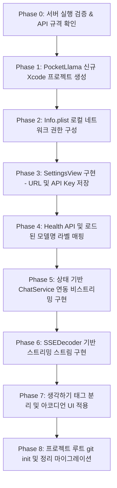

# SwiftUI PocketLlama iOS MVP 계획서 기술 리뷰

**리뷰일:** 2026-06-05  
**대상 문서:** `plans/swiftui-ollama-ios-mvp-plan.md`  

---

## 1. 개요
본 리뷰는 맥북에서 `llama.cpp` (`llama-server`)로 서빙 중인 35B GGUF 모델에 아이폰 SwiftUI 앱(PocketLlama)이 연결하는 MVP 설계안에 대한 **기술적 검증 및 위험 요소 분석** 문서입니다. 

개발 착수 전 해결해야 할 잠재적 위험 요소를 식별하고 이에 대한 해결 가이드를 제공합니다.

---

## 2. 핵심 위험 요소 및 권장 대안

### 🚨 위험 1: `llama-server`와 Anthropic `/v1/messages` API 규격 불일치
* **현상:** 순정 `llama.cpp` 패키지의 `llama-server`는 OpenAI 규격(`/v1/chat/completions`)을 네이티브로 구현하고 있으며, Anthropic 규격(`/v1/messages`)은 기본 탑재되어 있지 않습니다.
* **영향:** `llm-serving` 환경에 LiteLLM이나 커스텀 변환 프록시가 구현되어 있지 않다면, 앱에서 보낸 요청이 `404 Not Found` 에러로 실패합니다.
* **대안:** 
  1. 맥북의 `serve.sh` 스크립트를 분석하여 실제 Anthropic API를 포워딩해 주는 프록시가 돌고 있는지 확인해야 합니다.
  2. 프록시가 없는 경우, 클라이언트(`AnthropicChatClient`)를 프로토콜 기반으로 설계하여 OpenAI 규격(`/v1/chat/completions`)도 즉시 호환되도록 개발해야 합니다.

---

### 🚨 위험 2: Xcode 프로젝트 리네임의 빌드 오류 위험 (Phase 1)
* **현상:** 계획서에서는 기존 `ollama-iphone/` 프로젝트 폴더와 파일 구조를 `PocketLlama`로 리네임할 계획을 세우고 있습니다. 하지만 Xcode 프로젝트 구조의 특성상 수동 폴더명/타겟명 변경은 다수의 참조 유실 및 빌드 실패를 일으킵니다.
* **영향:** 단순 Hello World 프로젝트 변경을 위해 과도한 프로젝트 설정 디버깅 시간이 낭비될 수 있습니다.
* **대안:** 기존 `ollama-iphone` 폴더를 과감히 삭제하고, `app/` 디렉토리 하위에 **Xcode를 실행해 완전히 새 SwiftUI 프로젝트 `PocketLlama`를 깨끗하게 생성**하는 것을 적극 권장합니다.

---

### 🚨 위험 3: iOS 로컬 네트워크 권한 및 ATS(App Transport Security) 제한
* **현상:** iOS 14+ 기기는 로컬 네트워크 상의 다른 기기(맥북)와 통신 시 강한 제약을 받습니다. 
  1. 로컬 IP 주소(`http://192.168.0.10:8080`) 통신은 ATS 예외를 요구하지 않지만, **최초 통신 시 iOS 로컬 네트워크 권한 팝업**이 발생합니다.
  2. 만약 DHCP로 IP가 바뀔 것을 대비해 `macbook.local` 등 멀티캐스트 DNS(mDNS) 호스트를 사용한다면 ATS가 차단합니다.
* **영향:** 앱 실행 후 통신 시 응답 대기 상태에 빠지거나 즉시 에러가 발생합니다.
* **대안:** 앱의 `Info.plist`에 다음 키들을 필수로 선언해 두어야 합니다.
  ```xml
  <key>NSLocalNetworkUsageDescription</key>
  <string>맥북에서 작동 중인 로컬 LLM 서버에 연결하여 대화를 송수신합니다.</string>
  <key>NSAppTransportSecurity</key>
  <dict>
      <key>NSAllowsLocalNetworking</key>
      <true/>
  </dict>
  ```

---

### 🚨 위험 4: `0.0.0.0` 바인딩에 따른 공용 네트워크 보안 유출
* **현상:** 맥북의 서버 바인딩을 `0.0.0.0`으로 개방하면 동일 공유기(와이파이) 환경에 있는 누구나 내 맥북의 GPU 자원에 접근하여 모델을 실행하거나 프롬프트를 보낼 수 있습니다.
* **영향:** 보안 취약성 및 시스템 리소스 무단 점유 가능성이 생깁니다.
* **대안:**
  1. `llama-server` 기동 시 `--api-key <Key>` 옵션을 적용하여 API 호출 보호망을 만듭니다.
  2. 앱의 `SettingsView`에 **API Key 입력란**을 제공하고, `UserDefaults`에 저장하여 모든 통신 시 `Authorization: Bearer <Key>` 헤더를 담아 보내도록 설계합니다.

---

### 🚨 위험 5: 컨텍스트 인제스천(Prompt Ingestion) 지연 시 UX 처리
* **현상:** Qwen 35B와 같이 상대적으로 큰 모델에 긴 프롬프트를 전송하면, 맥북 성능에 따라 첫 번째 토큰이 생성되기 시작할 때까지(TTFT) 10초에서 1분 이상 걸릴 수 있습니다.
* **영향:** 단순 "로딩 인디케이터"만 띄워둘 경우 사용자는 앱이 멈춘 것으로 오해해 이탈하거나 전송 버튼을 연타할 수 있습니다.
* **대안:** 뷰 모델의 네트워크 상태를 아래와 같이 세분화하고, 화면에 구체적인 한글 안내를 제공합니다.
  * `.idle`: 입력 대기
  * `.connecting`: 서버 연결 시도 중
  * `.ingesting`: **"맥북이 프롬프트를 분석하고 있습니다 (대기 중)..."** (첫 토큰 수신 대기 상태)
  * `.generating`: 답변 생성 및 스트리밍 중
  * `.failed(Error)`: 에러 안내

---

### 🚨 위험 6: 추론 과정(Thinking Token) 파싱 및 전용 UI 적용
* **현상:** Qwen 계열 추론 모델은 응답 본문에 생각 과정(`<think>...</think>`)을 포함합니다. 이를 정제하지 않고 채팅 말풍선에 직접 렌더링하면 UI 가독성이 심각하게 저하됩니다.
* **대안:** 스트림으로 들어오는 텍스트 델타를 실시간으로 스캔하여 `<think>` 영역을 발라내고, SwiftUI `DisclosureGroup` 등을 통해 **"생각 과정 보기"**와 같은 토글 가능한 아코디언 UI 구조로 분리해 보여주어야 합니다.

---

## 3. Swift용 실시간 스트리밍(SSE) 파서 제안

URLSession의 `bytes.lines`를 안전하게 누적 처리하기 위한 전용 SSE 디코더 뼈대 코드입니다.

```swift
struct SSEEvent {
    var event: String?
    var data: String?
}

class SSEDecoder {
    private var buffer = ""
    
    /// 줄바꿈 단위로 들어오는 라인을 누적하다가, 더블 개행(\n\n) 발생 시 이벤트를 파싱해 반환합니다.
    func appendAndParse(_ line: String) -> SSEEvent? {
        if line.trimmingCharacters(in: .whitespacesAndNewlines).isEmpty {
            defer { buffer = "" }
            return parseBuffer(buffer)
        }
        buffer += line + "\n"
        return nil
    }
    
    private func parseBuffer(_ text: String) -> SSEEvent? {
        var eventType: String?
        var dataContent: String?
        
        let lines = text.components(separatedBy: .newlines)
        for line in lines {
            if line.hasPrefix("event:") {
                eventType = line.replacingOccurrences(of: "event:", with: "").trimmingCharacters(in: .whitespaces)
            } else if line.hasPrefix("data:") {
                let content = line.replacingOccurrences(of: "data:", with: "").trimmingCharacters(in: .whitespaces)
                dataContent = (dataContent ?? "") + content
            }
        }
        
        if dataContent != nil {
            return SSEEvent(event: eventType, data: dataContent)
        }
        return nil
    }
}
```

---

## 4. 최종 개선된 마이그레이션 로드맵


